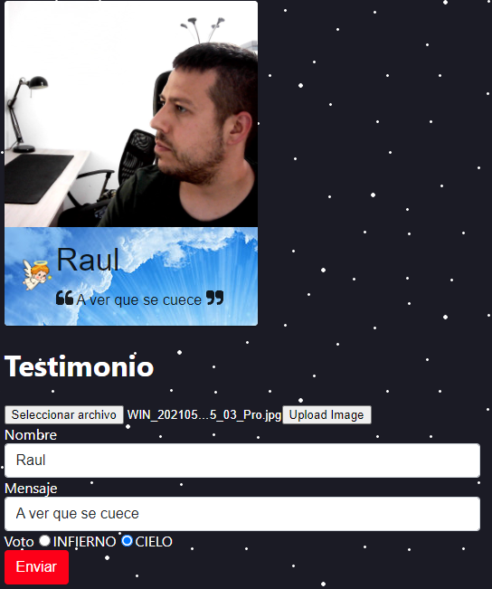
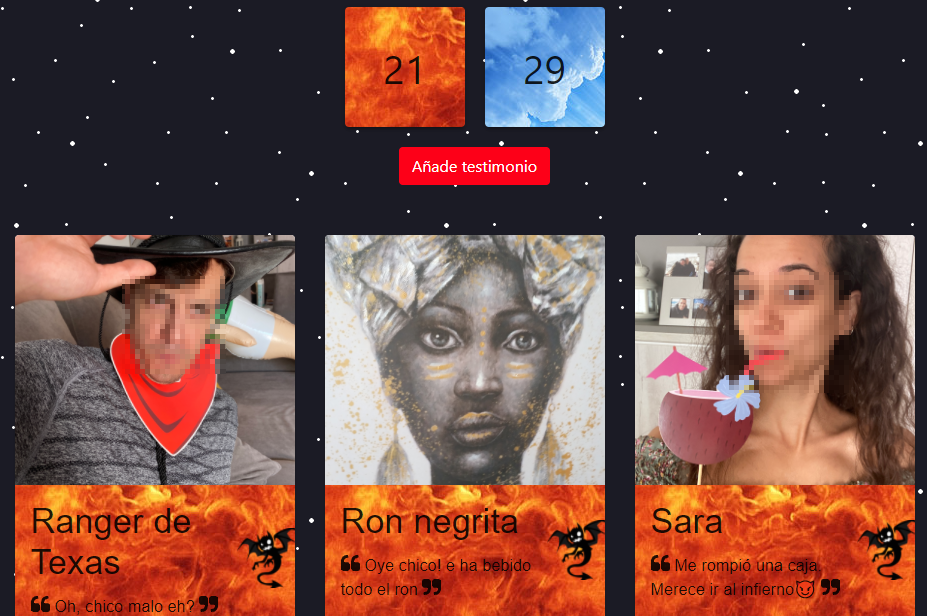

## Purgatorio App
App creada con la intención de disfrutar de mi cumpleaños 2021, de una forma diferente.

Aquí podéis ver el resultado:
https://purgatorio-app.web.app/

## Triangulis del asunto (Free)

- Firebase para persistir los datos excepto imagenes.
- Imagenes subidas a https://api.cloudinary.com
- React front-end con bootstrap y material-ui.
- Deploy en firebase.

## Descripción

El lore era que el cumpleañero estaba en el purgatorio y los testimonios decidían:
- Infierno o Cielo.

Cada testimonio con su mobil generaba una carta con imagen, nombre, descripción y voto.

En las TV de cocina y comedor, aparecían 3 cartas de testimonio de forma aleatoria.

El objetivo era ir creando contendio, con disfraces y elementos que teniamos en la casa.

Al acabar el día se mostraba el resultado de la votación y todas las cartas.

## ¿Que mejoraria?
- Diseño responsive.
- Comprimir imagenes antes de subirlas.

## Tiempo e idea

Le dedique las tardes una semana antes de mi cumpleaños.

La idea me vino el domingo de la semana anterior en otro cumpleaños. 

A la cumpleañera le dieron una tarjeta con firmas de los amigos y vi que los amigos, escribían cosas muy formales y bonitas.

Y quise que en el mío la gente escribiera sin formalismos y con la intención de divertirse.

  

